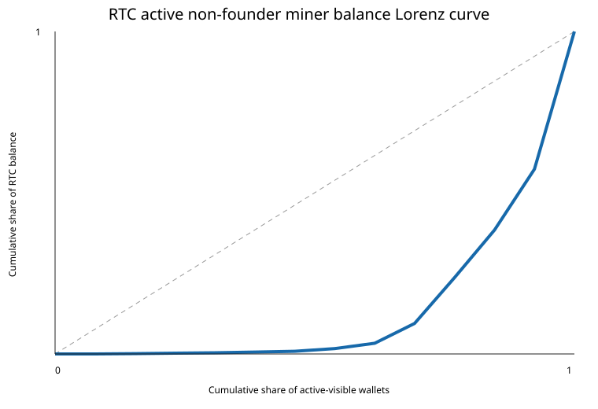

# RTC public balance distribution snapshot — 2026-09-11

**Bounty:** Scottcjn/rustchain-bounties#1113  
**Snapshot UTC:** `2026-09-11T12:54:45.675635+00:00`  
**Chain epoch:** `282` · enrolled miners: `17` · fixed supply reported by `/epoch`: `8,388,608 RTC`

## Scope: what the public API actually lets us measure

The bounty asks for all wallet balances, but the current public node does **not** expose a chain-wide wallet/rich-list API: `/api/balances` returns `401 admin_required`, while `/api/wallets`, `/api/holders`, and `/wallet/rich-list` return 404. I therefore do not label this a chain-wide holder distribution. It is a reproducible **active-miner balance snapshot**, plus a separately queried founder-wallet table from the four founder wallet names documented in RustChain tokenomics.

Method: `GET /api/miners?limit=1000` → one `GET /wallet/balance?miner_id=...` per returned miner. I separately queried the documented founder wallets (`founder_founders`, `founder_dev_fund`, `founder_team_bounty`, `founder_community`) so they can be excluded explicitly rather than guessed from names. No admin endpoint or credential was used.

## Active-visible distribution

| Metric | Value |
|---|---:|
| Active-visible wallets | 13 |
| Non-zero balances | 12 |
| Visible balance total | 1251.937351 RTC |
| Gini coefficient | 0.713883 |
| Top-1 share | 42.70% |
| Top-5 share | 96.68% |
| Top-10 share | 99.76% |

The visible active-miner set is strongly concentrated: the largest visible miner balance is about 42.7% of the active-visible RTC total, and the top five account for about 96.7%. This is a **small active subset**, not a governance/Nakamoto coefficient and not the distribution of all circulating RTC.



## Top 10 active-visible holders, excluding the four documented founder wallets

| Rank | Miner/wallet | RTC | Hardware | Multiplier |
|---:|---|---:|---|---:|
| 1 | `modern-sophia-Pow-9862e3be` | 534.586625 | x86 / broadwell | 1.05 |
| 2 | `RTC5800896ed658aa511D029361b6d7388ddb29248B` | 236.257074 | Apple Silicon / M2 | 1.2 |
| 3 | `RTC1c5093d221006a8c83132b808b86739cb26e809e` | 184.570268 | Windows / Intel64 Family 6 Model 158 Stepping 10, GenuineIntel | 0.8 |
| 4 | `RTC74b80ab40602e5ae31819912b2fca974484e5dab` | 178.007861 | ARM / aarch64 | 0.0005 |
| 5 | `RTC1410e82d545ce0b3ffd21ca83e2465a8f2c3a64e` | 76.907349 | Apple Silicon / M2 | 1.2 |
| 6 | `RTC14f06ee294f327f5685d3de5e1ed501cffab33e7` | 20.883299 | Apple Silicon / M4 | 1.05 |
| 7 | `cobalt-qube3-scott` | 10.455313 | x86 / retro | 1.4 |
| 8 | `jar9XPS` | 2.943038 | x86 / modern | 0.8 |
| 9 | `modern-sophiacore-3a168058` | 2.670063 | x86_64 / modern | 0.8 |
| 10 | `stepehenreed` | 1.706571 | x86 / modern | 0.8 |

Names such as `modern-sophia-*` are **not** silently reclassified as founder wallets here because the public tokenomics documentation names the founder wallets explicitly and does not provide a canonical ownership mapping for every miner ID. That avoids inventing exclusions.

## Documented founder wallets (queried separately)

| Wallet | Current queried RTC |
|---|---:|
| `founder_dev_fund` | 124951.060004 |
| `founder_founders` | 75497.470000 |
| `founder_team_bounty` | 51955.580000 |
| `founder_community` | 21310.942248 |

Their combined queried balance at this snapshot is **273715.052252 RTC**. These balances are intentionally not mixed into the active-miner Gini because the four wallets are protocol allocation/operations buckets rather than active-miner observations.

## Comparison with cryptocurrency concentration research

Direct numerical comparison needs care because address definitions and inclusion thresholds drastically change Gini values. A 2025 peer-reviewed Ethereum study using over 98 million addresses reports Gini values around **0.90–0.95** depending on inclusion criteria even after removing several non-individual wallet classes. A 2021 cross-cryptocurrency study found early distributions commonly start highly concentrated and reported that several major Ethereum tokens had Gini values close to 1. These are useful context for the direction of concentration, but they are **not apples-to-apples benchmarks** for this 13-wallet active-miner snapshot.

- Celig, Ockenga & Schoder (2025), *Distributional equality in Ethereum?* — https://www.nature.com/articles/s41599-025-04728-9
- Sai et al. (2021), *Characterizing Wealth Inequality in Cryptocurrencies* — https://www.frontiersin.org/journals/blockchain/articles/10.3389/fbloc.2021.730122/full

The responsible conclusion is therefore not “RustChain is more equal than Ethereum.” It is: **the currently active-visible miner balances are top-heavy, while the public API is insufficient to estimate the full chain-wide holder Gini.** A proper chain-wide analysis needs a public paginated wallet-balance export or rich-list endpoint.

## Reproduction

```bash
python3 analyze.py
```

Artifacts: `wallets.csv`, `summary.json`, `lorenz.svg`, and the standard-library/requests analysis script. All network calls are read-only.

## Disclosure

AI assistance was used to inspect the API and format the report. The snapshot values were fetched live and calculations are reproducible from the included artifacts. No payout is asserted until a canonical RustChain wallet transfer is visible.
